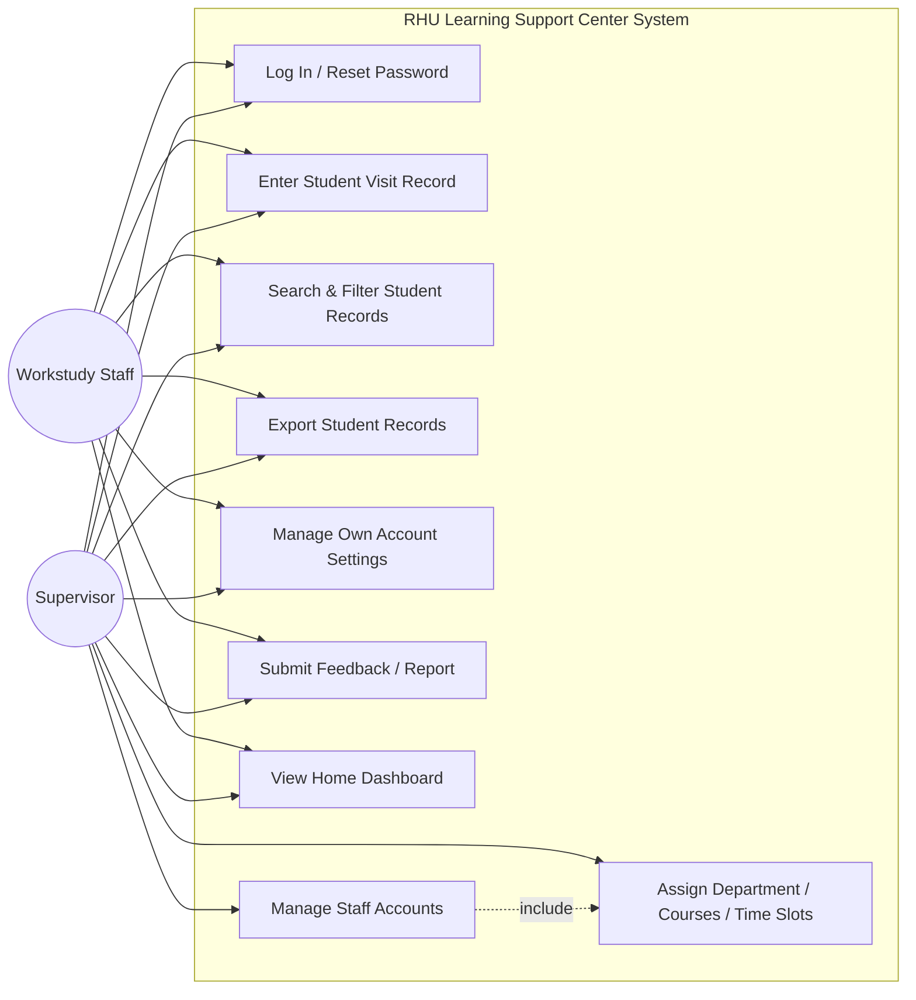

# RHU Learning Support Center — Website

A role-based web platform for Rafik Hariri University's Learning Support Center (LSC), built to digitize how student tutoring/workstudy visits are recorded and managed. This is Bahaa Rawass's Final Year Project (FYP).

## Table of Contents

- [RHU Learning Support Center — Website](#rhu-learning-support-center--website)
  - [Table of Contents](#table-of-contents)
  - [1. Project Definition](#1-project-definition)
  - [2. Project Description and Objectives](#2-project-description-and-objectives)
  - [3. Requirement Analysis](#3-requirement-analysis)
    - [3.1 Functional Requirements](#31-functional-requirements)
    - [3.2 Non-Functional Requirements](#32-non-functional-requirements)
  - [4. Literature Review: System Users and Services](#4-literature-review-system-users-and-services)
    - [Supervisor](#supervisor)
    - [Workstudy (Tutor/Staff)](#workstudy-tutorstaff)
    - [Student (currently a data record, not a system account)](#student-currently-a-data-record-not-a-system-account)
  - [5. Use Case Diagram](#5-use-case-diagram)
  - [6. Future Work / Roadmap](#6-future-work--roadmap)
  - [7. Tech Stack](#7-tech-stack)

---

## 1. Project Definition

The **RHU Learning Support Center Website** is a Supabase-backed React/TypeScript web application that replaces the Learning Support Center's manual, paper-based tracking of student tutoring visits with a centralized digital system. It allows Center staff (Workstudy tutors and Supervisors) to log student visits, record which courses a student asked for help with, and maintain a searchable history of all Center activity — all under a single authenticated, role-aware interface.

## 2. Project Description and Objectives

The Learning Support Center currently relies on staff manually entering student visit data with limited structure, no centralized search, and no clear separation between staff permission levels. This project addresses that gap.

**Objectives:**

- Provide a single, authenticated web portal for Center staff to record student visits (name, ID, department, courses asked about, visit date/time, contact email).
- Distinguish between **Supervisor** and **Workstudy** staff accounts, with Supervisors able to manage other staff accounts.
- Let staff search, filter, and export student visit records (by name, email, department, date, or course).
- Give staff a way to manage their own account settings, security, and appearance preferences.
- Provide a feedback/report channel so staff can flag issues or suggest improvements.
- Lay a technical foundation (typed Supabase layer, Edge Functions, React Query caching) that can be extended toward self-service student registration and scheduling (see [Future Work](#6-future-work--roadmap)).

## 3. Requirement Analysis

### 3.1 Functional Requirements

- **Authentication:** Users can log in, and reset their password via email.
- **Student Visit Entry:** Staff can create a new student record capturing student name, ID, department, courses asked about, visit date/time, and optional email; the system checks for and can link to an existing student.
- **Student Records Management:** Staff can view a table of all student visit records, filter/search by name, email, department, date, or course, and export the filtered results.
- **Workstudy/Supervisor Account Management:** Supervisors can create, edit, and delete Workstudy and Supervisor accounts, including their department, time slots, and role.
- **Account Settings:** Each user can manage their own account details, security settings (e.g. password), appearance preferences, and data/record-related options, including a "danger zone" for destructive actions.
- **Feedback & Reporting:** Users can submit feedback or report an issue through a dedicated support form.
- **Home Dashboard:** An authenticated landing page summarizing relevant information for the logged-in staff member.

### 3.2 Non-Functional Requirements

- **Security:** Role-based access (Supervisor vs. Workstudy) enforced via Supabase Auth and typed Edge Functions; sensitive operations (user creation/deletion) run server-side rather than client-side.
- **Performance:** Data fetching and caching handled via TanStack React Query, with differentiated stale times for live vs. static data to minimize redundant network calls.
- **Usability:** Consistent, accessible UI built on shadcn/Radix UI primitives and Tailwind CSS, with light/dark appearance support.
- **Maintainability:** Clear separation between a pure Supabase service layer (`src/services/`) and React Query hooks; typed database access via generated `database.types.ts`.
- **Reliability:** Structured logging and consistent `{ data, error }` response shapes across all backend Edge Functions.
- **Scalability:** Backend logic isolated in Supabase Edge Functions so new workflows (e.g. registration, booking) can be added without restructuring the core data layer.

## 4. Literature Review: System Users and Services

The system currently defines two authenticated staff roles, plus a normal student "record" that is not (yet) a system user in its own right.

### Supervisor

Full administrative staff role for the Learning Support Center.

- Everything a Workstudy account can do (below), plus:
- Create, edit, and delete Workstudy and Supervisor accounts.
- Assign/adjust department, courses, and time slots for staff.
- Access account danger-zone actions (e.g. destructive data operations).

### Workstudy (Tutor/Staff)

Day-to-day operating role for students employed by the Center.

- Log in and manage their own profile, security, and appearance settings.
- Enter new student visit records (name, ID, department, courses asked about, visit date/time, optional email).
- Search, filter, and export the student records table.
- Submit feedback or report issues via the Support page.
- View the Home dashboard.

### Student (currently a data record, not a system account)

Students are the subjects of visit records rather than authenticated users of the current system — a staff member enters their information on their behalf. Turning students into first-class ("guest") accounts is the core idea behind the Future Work roadmap below.

## 5. Use Case Diagram

## 6. Future Work / Roadmap

The system today mainly supports **data entry by Supervisors/Workstudy staff**. The longer-term goal is a full self-service system that automates registration, scheduling, and reporting end-to-end.

- **Idea 0 — Guest accounts:** Let normal students create a guest account to view the website (a first step toward students being real system users, not just records).
- **Idea 1 — Workstudy registration page:** A dedicated page where students can register for the workstudy program with their name, ID, courses they want to teach, time slots, transcript, and schedule.
- **Idea 2 — Redesigned staff review page:** Supervisors review registered students, adjust their courses/time slots, and accept or reject applications. Accepted students get an email to confirm/deny their assigned schedule; confirming auto-creates their account (email + student ID as password); denying routes an email reply directly to the supervisor to discuss further. The staff page shows each applicant's status (waiting/confirmed/denied) in a table.
- **Idea 3 — Redesigned Home page:** A calendar view of all workstudy time slots with full details, plus a search bar to search by name, time slot, date, or courses.
- **Idea 4 — Booking system for guests:** Guest (student) accounts can book a workstudy visit, entering name, ID, visit date, courses, and optional email; this creates a visit record automatically. Both guest and workstudy staff get a confirmation email; either side can cancel/decline.
- **Idea 5 — Student Affairs integration:** Integrate the workstudy paperwork process with Student Affairs, potentially via a subdomain or separate page (requires a coordination meeting with Student Affairs).
- **Idea 6 — "About LSC" page:** A page describing the Learning Support Center, including the current hourly workstudy rate in both LBP and USD, per hour and per semester.
- **Idea 7 — Payment integration:** Support workstudy payment via card, Wish, or in person (scheduled pickup at the finance office); the finance office receives an email with transaction details for whichever method is chosen.
- **Idea 8 — Semester-scoped records (important):** Tie records to a specific semester so historical data (e.g. Fall 2026) is preserved rather than wiped, with each new semester (e.g. Spring 2027) starting from a blank state.

## 7. Tech Stack

- **Frontend:** React 19, TypeScript, Vite, React Router v7, Tailwind CSS v4, shadcn/Radix UI, TanStack React Query v5
- **Backend:** Supabase (Postgres, Auth, Edge Functions), Resend (transactional email)
- **Other:** date-fns, xlsx (record export), react-day-picker
