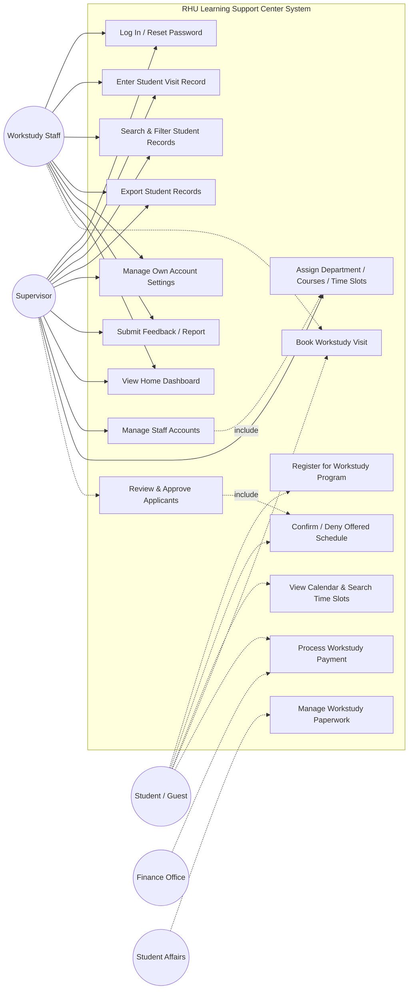

# RHU Learning Support Center — Website

A role-based web platform for Rafik Hariri University's Learning Support Center (LSC). This is Bahaa Rawass's Final Year Project (FYP): a system currently used by Center staff to digitize tutoring/workstudy visit tracking, being grown into a full self-service platform for registration, scheduling, and reporting.

## Table of Contents

- [RHU Learning Support Center — Website](#rhu-learning-support-center--website)
  - [Table of Contents](#table-of-contents)
  - [1. Project Definition](#1-project-definition)
  - [2. Project Description and Objectives](#2-project-description-and-objectives)
  - [3. Requirement Analysis](#3-requirement-analysis)
    - [3.1 Functional Requirements](#31-functional-requirements)
    - [3.2 Non-Functional Requirements](#32-non-functional-requirements)
  - [4. Literature Review: System Users and Services](#4-literature-review-system-users-and-services)
    - [Supervisor (current)](#supervisor-current)
    - [Workstudy (Tutor/Staff) (current)](#workstudy-tutorstaff-current)
    - [Student / Guest (currently a data record; planned as a full account)](#student--guest-currently-a-data-record-planned-as-a-full-account)
    - [External Stakeholders (planned)](#external-stakeholders-planned)
  - [5. Use Case Diagram](#5-use-case-diagram)
  - [6. Tech Stack](#6-tech-stack)

---

## 1. Project Definition

The **RHU Learning Support Center Website** is a Supabase-backed React/TypeScript web application built to replace the Learning Support Center's manual, paper-based tracking of student tutoring visits with a centralized digital system. In its current phase, it lets Center staff (Workstudy tutors and Supervisors) log student visits, record which courses a student asked for help with, and maintain a searchable history of Center activity under a single authenticated, role-aware interface.

The project is defined more broadly, however, than a staff data-entry tool: the end goal is a complete workstudy lifecycle system that also lets students register for the program themselves, lets Supervisors review and approve applicants, automates account provisioning and scheduling, and eventually integrates booking, Student Affairs paperwork, and payment — while preserving records across semesters. The current system is Phase 1 of that larger definition.

## 2. Project Description and Objectives

The Learning Support Center currently relies on staff manually entering student visit data with limited structure, no centralized search, and no clear separation between staff permission levels — and it has no way for students to register or engage with the program directly. This project addresses both problems, in two layers of objectives.

**Current objectives (implemented):**

- Provide a single, authenticated web portal for Center staff to record student visits (name, ID, department, courses asked about, visit date/time, contact email).
- Distinguish between **Supervisor** and **Workstudy** staff accounts, with Supervisors able to manage other staff accounts.
- Let staff search, filter, and export student visit records (by name, email, department, date, or course).
- Give staff a way to manage their own account settings, security, and appearance preferences.
- Provide a feedback/report channel so staff can flag issues or suggest improvements.
- Lay a technical foundation (typed Supabase layer, Edge Functions, React Query caching) that can be extended toward self-service student registration and scheduling.

**Planned objectives (future phases):**

- Let normal students create **guest accounts** to view the website, and eventually register for the workstudy program themselves — submitting name, ID, courses they want to teach, time slots, transcript, and schedule.
- Replace manual data entry with a **review-and-approval workflow**: Supervisors review applicants, adjust their courses/time slots, and accept or reject them, with automated emails and automatic account creation on acceptance.
- Turn the Home page into a **calendar-based scheduling view** with search by name, time slot, date, or course.
- Let guest/student accounts **book** a workstudy visit directly, with automatic record creation and confirmation emails to both sides.
- Integrate the **Student Affairs** paperwork process into the platform.
- Add an **About LSC** page describing the Center and its hourly workstudy rate (in LBP and USD).
- Support **workstudy payment** via card, Wish, or in-person pickup, with automatic notification to the finance office.
- Move from a single flat dataset to **semester-scoped records**, so data from past semesters (e.g. Fall 2026) is preserved rather than overwritten when a new semester (e.g. Spring 2027) begins.

## 3. Requirement Analysis

### 3.1 Functional Requirements

**Implemented:**

- **Authentication:** Users can log in, and reset their password via email.
- **Student Visit Entry:** Staff can create a new student record capturing student name, ID, department, courses asked about, visit date/time, and optional email; the system checks for and can link to an existing student.
- **Student Records Management:** Staff can view a table of all student visit records, filter/search by name, email, department, date, or course, and export the filtered results.
- **Workstudy/Supervisor Account Management:** Supervisors can create, edit, and delete Workstudy and Supervisor accounts, including their department, time slots, and role.
- **Account Settings:** Each user can manage their own account details, security settings (e.g. password), appearance preferences, and data/record-related options, including a "danger zone" for destructive actions.
- **Feedback & Reporting:** Users can submit feedback or report an issue through a dedicated support form.
- **Home Dashboard:** An authenticated landing page summarizing relevant information for the logged-in staff member.

**Planned:**

- **Guest Accounts:** Self-service accounts for normal students to view the site.
- **Workstudy Registration:** A registration form capturing name, ID, desired courses, time slots, transcript, and schedule.
- **Applicant Review Workflow:** A staff view listing applicants with status (waiting/confirmed/denied), editable courses/time slots, accept/reject actions, and automated confirmation emails.
- **Automatic Account Provisioning:** On acceptance and student confirmation, an account is auto-created using the student's email and ID as the initial password.
- **Calendar & Search Home Page:** A calendar of workstudy time slots with search by name, time slot, date, or course.
- **Booking System:** Guests can book a workstudy visit; both parties receive confirmation emails and can cancel/decline.
- **Student Affairs Integration:** A page or subdomain covering workstudy paperwork, coordinated with Student Affairs.
- **About LSC Page:** Static information page including hourly rate in LBP and USD.
- **Payment Processing:** Card, Wish, or in-person payment options, with an automatic email to the finance office per transaction.
- **Semester-Scoped Records:** Records tagged and partitioned by semester, with a clean slate at the start of each new semester.

### 3.2 Non-Functional Requirements

**Implemented:**

- **Security:** Role-based access (Supervisor vs. Workstudy) enforced via Supabase Auth and typed Edge Functions; sensitive operations (user creation/deletion) run server-side rather than client-side.
- **Performance:** Data fetching and caching handled via TanStack React Query, with differentiated stale times for live vs. static data to minimize redundant network calls.
- **Usability:** Consistent, accessible UI built on shadcn/Radix UI primitives and Tailwind CSS, with light/dark appearance support.
- **Maintainability:** Clear separation between a pure Supabase service layer (`src/services/`) and React Query hooks; typed database access via generated `database.types.ts`.
- **Reliability:** Structured logging and consistent `{ data, error }` response shapes across all backend Edge Functions.
- **Scalability:** Backend logic isolated in Supabase Edge Functions so new workflows (e.g. registration, booking) can be added without restructuring the core data layer.

**Planned:**

- **Data Integrity Across Time:** Semester-scoped records must guarantee historical data is never lost or overwritten when a new semester starts.
- **Auditability:** Payment and account-provisioning workflows must leave a traceable email/record trail (finance office notifications, applicant status history).
- **Extensibility for External Integration:** Student Affairs and payment integrations should be addable without a core architecture rewrite (e.g. via a subdomain or isolated module).
- **Availability during registration windows:** As real student self-registration is added, the system needs to reliably handle concurrent applicant submissions.

## 4. Literature Review: System Users and Services

The system currently defines two authenticated staff roles, plus a student "record" that is not yet a system user in its own right. Planned phases introduce a third user type (Student/Guest) and two external stakeholders.

### Supervisor (current)

Full administrative staff role for the Learning Support Center.

- Everything a Workstudy account can do (below), plus:
- Create, edit, and delete Workstudy and Supervisor accounts.
- Assign/adjust department, courses, and time slots for staff.
- Access account danger-zone actions (e.g. destructive data operations).
- _(Planned)_ Review workstudy applicants, adjust their courses/time slots, and accept or reject them.

### Workstudy (Tutor/Staff) (current)

Day-to-day operating role for students employed by the Center.

- Log in and manage their own profile, security, and appearance settings.
- Enter new student visit records (name, ID, department, courses asked about, visit date/time, optional email).
- Search, filter, and export the student records table.
- Submit feedback or report issues via the Support page.
- View the Home dashboard.
- _(Planned)_ Decline a booked visit if something urgent comes up.

### Student / Guest (currently a data record; planned as a full account)

Today, students are the subject of a visit record entered by staff on their behalf, not authenticated users. The planned guest/student role would offer:

- Viewing the website as a guest.
- Registering for the workstudy program (name, ID, courses, time slots, transcript, schedule).
- Confirming or denying an offered schedule by email; confirming auto-creates their account.
- Booking a workstudy visit and receiving/cancelling booking confirmations.
- Viewing their own application/booking status.

### External Stakeholders (planned)

- **Student Affairs:** Coordinates on integrating workstudy paperwork into the platform (Idea 5).
- **Finance Office:** Receives automated email notification of workstudy payment transactions and their details (Idea 7).

## 5. Use Case Diagram

Solid arrows represent use cases already implemented; dashed arrows represent planned/future use cases.

```mermaid
graph LR
    Supervisor((Supervisor))
    Workstudy((Workstudy Staff))
    Student((Student / Guest))
    Finance((Finance Office))
    Affairs((Student Affairs))

    subgraph "RHU Learning Support Center System"
        UC1[Log In / Reset Password]
        UC2[Enter Student Visit Record]
        UC3[Search & Filter Student Records]
        UC4[Export Student Records]
        UC5[Manage Own Account Settings]
        UC6[Submit Feedback / Report]
        UC7[View Home Dashboard]
        UC8[Manage Staff Accounts]
        UC9[Assign Department / Courses / Time Slots]
        UC10[Register for Workstudy Program]
        UC11[Review & Approve Applicants]
        UC12[Confirm / Deny Offered Schedule]
        UC13[View Calendar & Search Time Slots]
        UC14[Book Workstudy Visit]
        UC15[Process Workstudy Payment]
        UC16[Manage Workstudy Paperwork]
    end

    Workstudy --> UC1
    Workstudy --> UC2
    Workstudy --> UC3
    Workstudy --> UC4
    Workstudy --> UC5
    Workstudy --> UC6
    Workstudy --> UC7
    Workstudy -.-> UC14

    Supervisor --> UC1
    Supervisor --> UC2
    Supervisor --> UC3
    Supervisor --> UC4
    Supervisor --> UC5
    Supervisor --> UC6
    Supervisor --> UC7
    Supervisor --> UC8
    Supervisor --> UC9
    Supervisor -.-> UC11

    UC8 -.include.-> UC9

    Student -.-> UC10
    Student -.-> UC12
    Student -.-> UC13
    Student -.-> UC14
    Student -.-> UC15

    Finance -.-> UC15
    Affairs -.-> UC16
    UC11 -.include.-> UC12
```

## 6. Tech Stack

- **Frontend:** React 19, TypeScript, Vite, React Router v7, Tailwind CSS v4, shadcn/Radix UI, TanStack React Query v5
- **Backend:** Supabase (Postgres, Auth, Edge Functions), Resend (transactional email)
- **Other:** date-fns, xlsx (record export), react-day-picker
